# iglo

iglo (Intuitive Graphics Layer Open-source) is a low-level, public domain C++ rendering abstraction layer for D3D12 and Vulkan. The aim of iglo is to make these low level graphics APIs more intuitive and fun to use, without limiting their full potential. Additionally, iglo handles window creation and mouse/keyboard input.

The Vulkan implementation is still in progress, and currently, **iglo supports only D3D12**.

## Roadmap

- [x] D3D12
- [ ] Vulkan (1% complete)
- [ ] Cross-platform
  - [x] Windows
  - [ ] Linux (50% complete)
  - [ ] macOS
- [x] Helper components for 2D rendering
  -  [x] ig::Font
  -  [x] ig::BatchRenderer
- [ ] Helper components for 3D rendering
  -  [ ] Parse 3D mesh files
  -  [ ] Material shaders and pipelines
  -  [ ] Improved camera class

## Features

- Written in C++17.
- Lightweight and easy to setup.
- Fully bindless rendering with SM6.6's ResourceDescriptorHeap and SamplerDescriptorHeap.
- Enhanced barrers (D3D12).
- UTF-8 internal string representation.
- Vector, matrix and quaternion classes. All with relevant math functions.
- Helper functions for:
  - Reading/writing files
  - Randomness (rand and mt19937)
  - UTF string conversions and string manipulation
- Simple app loop callbacks such as Start(), Update(), Draw(), OnEvent() and OnLoopExited().
- Easy 2D rendering with the BatchRenderer class (you can easily draw text, sprites, shapes, etc...)
- Fonts
  - Can load .ttf and .otf files.
  - Can load pre-baked font files (pre-rendered glyph atlases).
  - Supports signed distance fields with glow and outline effects.
- Manages the window and handles mouse/keyboard input.

## Gallery

> The `Lighting and Shadows` example project.
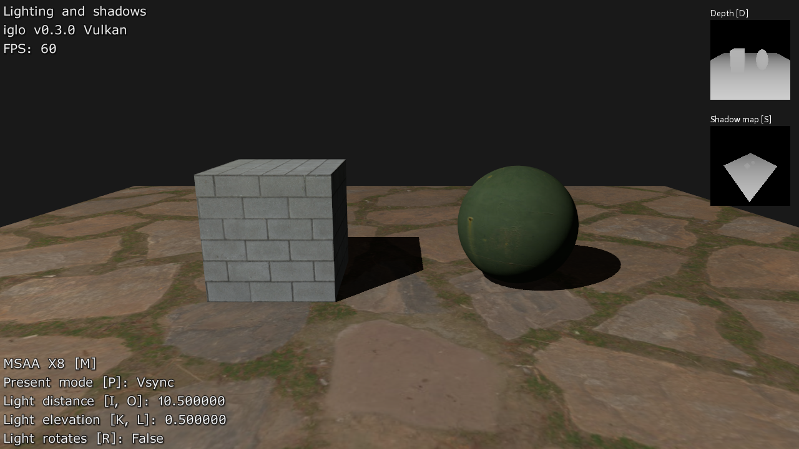

Click to show more

> The `Camera and Skybox` example project demonstrates how to use the ig::BaseCamera class and how to render a skybox. It also demonstrates how to use instancing to render models (cubes in this case).
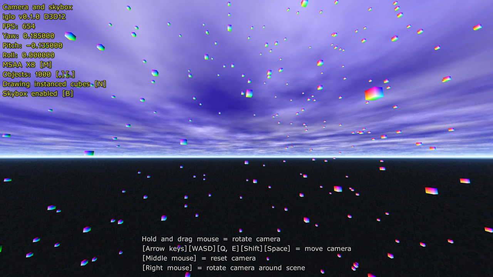

> The `Hello BatchRenderer` example project demonstrates how to use the ig::BatchRenderer class to render various types of 2D geometry.
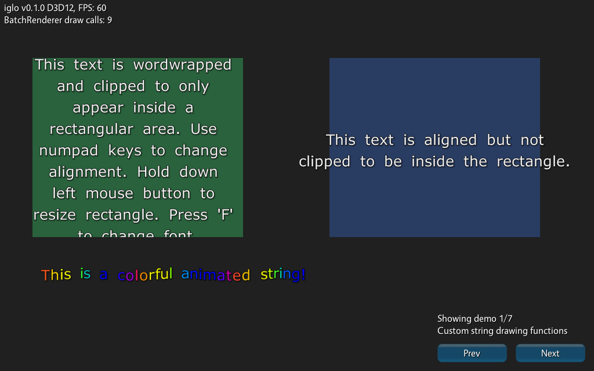
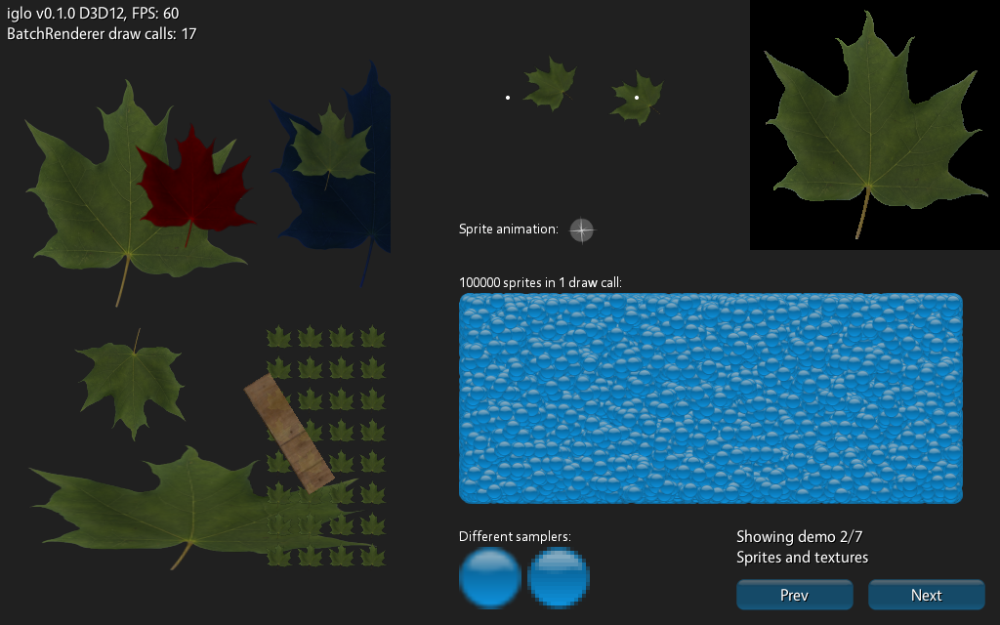
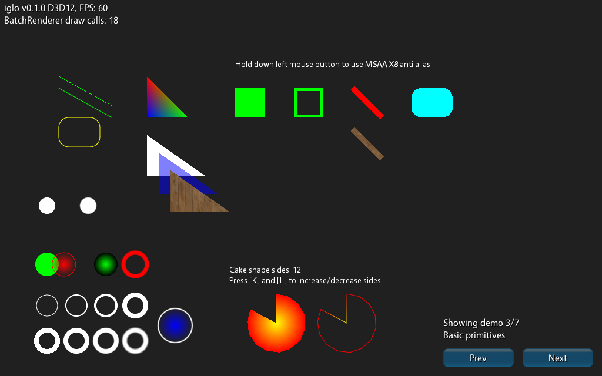
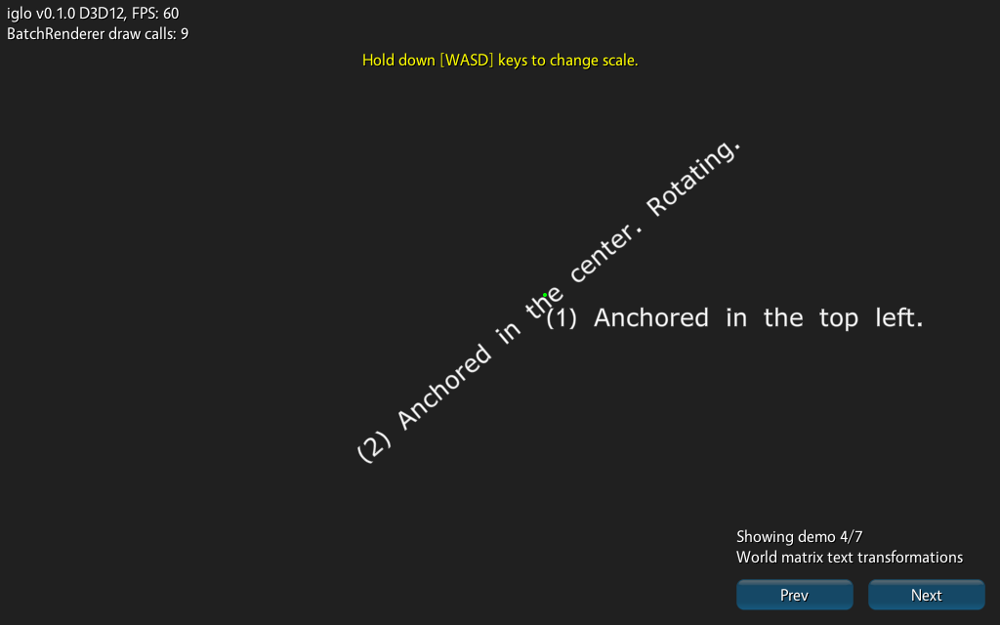
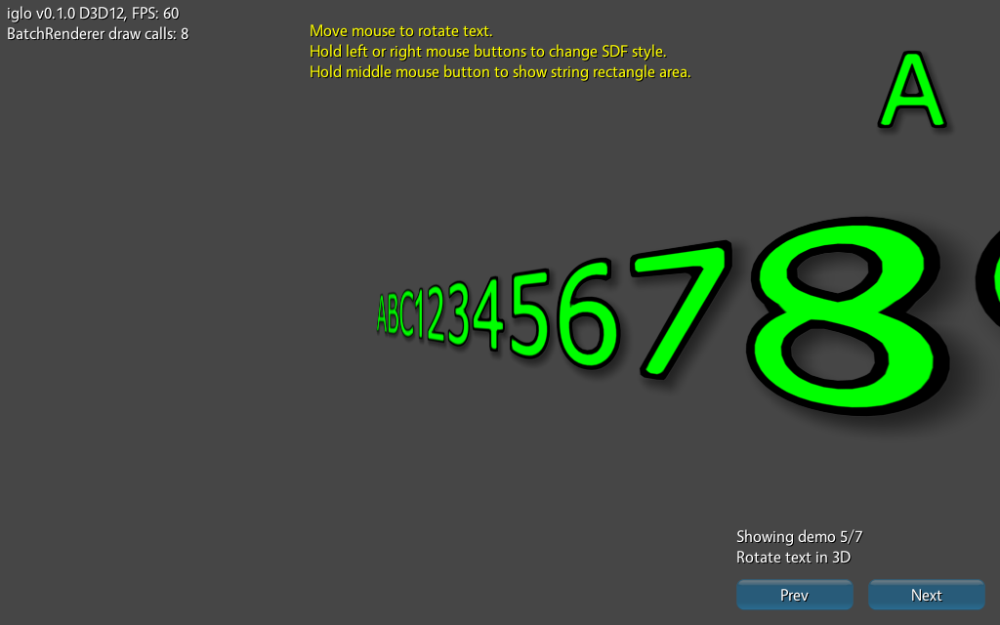
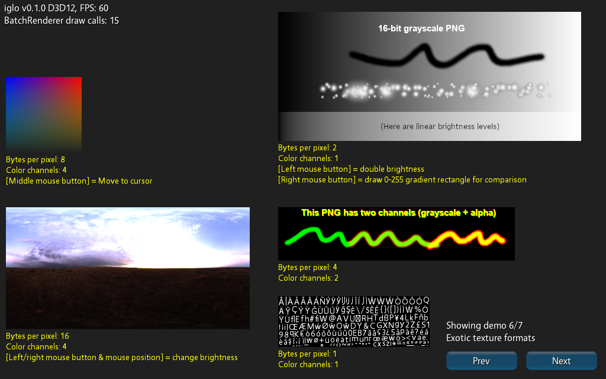
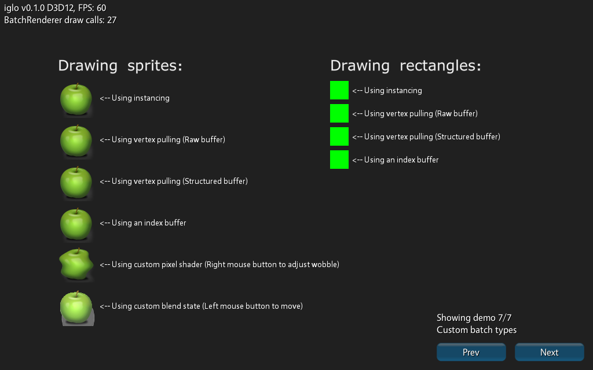

> The `Hello cube` and `Hello world` example projects.
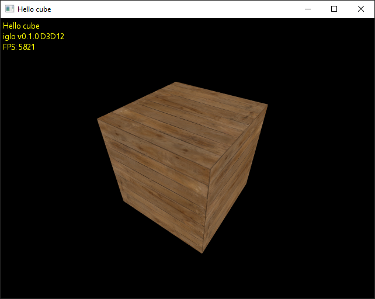
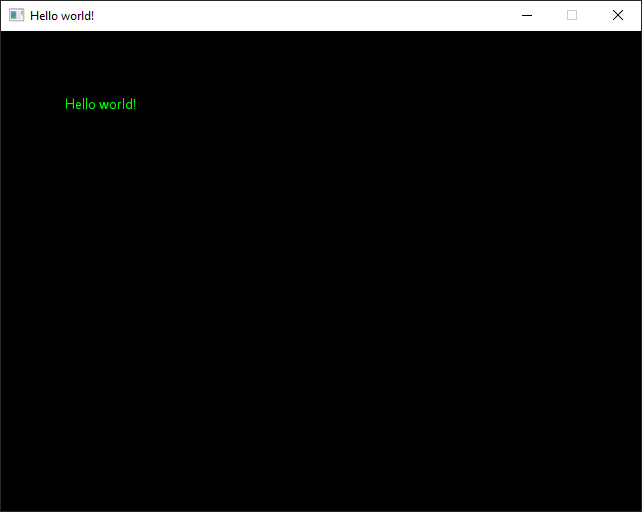

## Build and Run

### Requirements

These are the minimum system requirements needed to run an iglo app:

- Windows 10 (version 1909 or later)
- Shader model 6.6 capable graphics card and graphics drivers

### Windows

Follow these steps to build and run the iglo example projects on Windows:

1. Ensure you have [CMake](https://cmake.org/download/) installed and accessible from the command line. Version 3.22 or higher is required.

2. Run `build.cmd` to generate the Visual Studio 2019 project files using CMake. The generated project files will appear in a folder named `build`. 
   - **Note**: An internet connection is required during this step for CMake to download Agility SDK (required for D3D12). The Agility SDK package will also be placed in the `build` folder.

### Linux

This is a work in progress...

### iglo and Visual Studio

Follow these steps to create a new iglo project in Visual Studio 2019:  

1. Open Visual Studio and create a new **Empty C++ Project**.  

2. Right-click on the project in the Solution Explorer and select **Properties**. Navigate to **Linker** → **System** → **Subsystem**, and set it to **Not Set**.  

3. In the same **Properties** window, go to **General** → **C++ Language Standard**, and select **C++17**.  

4. Copy and paste the example iglo "Hello World" code (provided below) into a new file named `main.cpp`.  

5. Go to **Properties** → **C/C++** → **Additional Include Directories**, and add the path to the `iglo` source folder `/src/`.  

6. In the Solution Explorer, create a new **Filter** named `iglo` under your project. Add all source files from the iglo `/src/` directory to this filter. You don't have to add the files from `/src/stb/` and `/src/shaders/`. 

7. Right-click on the project and select **Manage NuGet Packages...**. Check the box for **Include prerelease**. Install the latest prerelease version of **Microsoft.Direct3D.D3D12** (DirectX 12 Agility SDK).  

8. In your `main.cpp` file, ensure the `UINT D3D12SDKVersion` value matches the version of the Agility SDK you installed.  

You can now build and run your iglo project!

### Hello world example

Click to show code

  
    #include "iglo.h"
    #include "igloFont.h"
    #include "igloBatchRenderer.h"
    #include "igloMainLoop.h"
    
    #ifdef IGLO_D3D12
    // Agility SDK path and version. Support for enhanced barriers and shader model 6.6 is required.
    extern "C" { __declspec(dllexport) extern const UINT D3D12SDKVersion = 715; }
    extern "C" { __declspec(dllexport) extern const char* D3D12SDKPath = u8".\\D3D12\\"; }
    #endif
    
    ig::IGLOContext context;
    ig::CommandList cmd;
    ig::Font defaultFont;
    ig::BatchRenderer r;
    ig::MainLoop mainloop;
    
    void Start()
    {
    	cmd.Load(context, ig::CommandListType::Graphics);
    
    	cmd.Begin();
    	{
    		defaultFont.LoadAsPrebaked(context, cmd, ig::GetDefaultFont()); // Load embedded prebaked font
    		r.Load(context, cmd, context.GetBackBufferRenderTargetDesc());
    	}
    	cmd.End();
    
    	// Submit work to the GPU and wait for the work to complete before proceeding
    	context.WaitForCompletion(context.Submit(cmd));
    }
    
    void OnLoopExited()
    {
    	context.WaitForIdleDevice(); // Wait for GPU to finish all remaining work before resources get released
    }
    
    void Update(double elapsedSeconds)
    {
    }
    
    void OnEvent(ig::Event e)
    {
    	if (e.type == ig::EventType::CloseRequest)
    	{
    		mainloop.Quit();
    		return;
    	}
    }
    
    void Draw()
    {
    	cmd.Begin();
    	{
    		// The back buffer will now be used as a render target
    		cmd.AddTextureBarrier(context.GetBackBuffer(), ig::SimpleBarrier::Common, ig::SimpleBarrier::RenderTarget, false);
    		cmd.FlushBarriers();
    
    		cmd.SetRenderTarget(&context.GetBackBuffer());
    		cmd.SetViewport((float)context.GetWidth(), (float)context.GetHeight());
    		cmd.SetScissorRectangle(context.GetWidth(), context.GetHeight());
    		cmd.ClearColor(context.GetBackBuffer(), ig::Colors::Black);
    
    		r.Begin(cmd);
    		{
    			r.DrawString(64, 64, "Hello world!", defaultFont, ig::Colors::Green);
    		}
    		r.End();
    
    		// The back buffer will now be used to present
    		cmd.AddTextureBarrier(context.GetBackBuffer(), ig::SimpleBarrier::RenderTarget, ig::SimpleBarrier::Common, false);
    		cmd.FlushBarriers();
    	}
    	cmd.End();
    
    	context.Submit(cmd);
    	context.Present();
    }
    
    #ifdef _WIN32
    int WINAPI WinMain(HINSTANCE hInstance, HINSTANCE hPrevInst, LPSTR lpCmdLine, int nShow)
    #endif
    #ifdef __linux__
    int main(int argc, char** argv)
    #endif
    {
    	if (context.Load(
    		ig::WindowSettings("Hello world!", 640, 480),
    		ig::RenderSettings(ig::PresentMode::Vsync)))
    	{
    		mainloop.Run(context, Start, OnLoopExited, Draw, Update, OnEvent);
    	}
    	// The iglo objects declared on the stack get released here in the reverse order they were declared
    	return 0;
    }

## Third Party Libraries/Assets

- [stb_truetype.h](https://github.com/nothings/stb/)
- [stb_image.h](https://github.com/nothings/stb/)
- [stb_image_write.h](https://github.com/nothings/stb/)
- [Vegur font (used as iglo's default font)](https://www.fontspace.com/vegur-font-f7408)

## Contributing

Please read [CONTRIBUTING.md](CONTRIBUTING.md) for details on how to contribute to this project.

## Authors

- Initial work: [Christoffer Chiniquy](https://github.com/c-chiniquy)

## License

iglo is in the public domain. iglo is also licensed under the MIT open source license for lawyers who are unhappy with public domain.

## Acknowledgments

[Alex Tardif's blog post on rendering abstraction layers](https://alextardif.com/RenderingAbstractionLayers.html)\
[gingerBill's public domain math functions](https://github.com/gingerBill/gb/blob/master/gb_math.h)\
[Jeff Bezanson's public domain utf8 functions](https://github.com/JeffBezanson/cutef8/blob/master/utf8.c)\
[wareya's public domain utf conversion functions](https://github.com/wareya/unishim/blob/master/unishim.h)\
[sheredom's public domain utf8 functions](https://github.com/sheredom/utf8.h/blob/master/utf8.h)\
[littlstar's public domain DDS loading code](https://github.com/littlstar/soil/)
